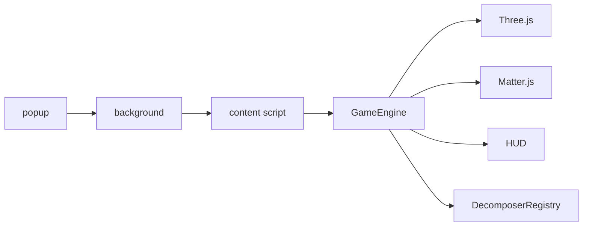

# Architecture

## Overview

Black Hole is a Chrome extension that injects a transparent game layer into the active tab. The content script owns the game runtime. The popup and background service worker only manage settings, tab state, and start/stop commands.

## Layers

## Decomposer pipeline

1. Walk visible DOM nodes in the viewport
2. Skip scripts, styles, tiny nodes, and empty regions
3. Classify each node as button, text, image, or unknown
4. Spawn shape descriptors (`pyramid`, `layer`, `cube`)
5. Count `totalElements` and build the 10-level growth curve

## Growth model

- Linear cumulative thresholds: level `n` requires `totalElements * n / 10` consumed items
- Hole radius is discrete per level
- Progress ring uses the current level span

## Settings

Stored in `chrome.storage.sync`:

- overlay opacity
- music enabled/volume
- sfx enabled/volume

Opacity is controlled from the in-game HUD and persisted between sessions.
